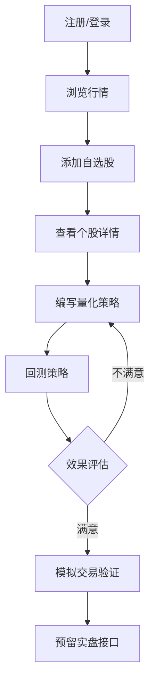

# 量化交易平台 PRD

## 1. 产品概述

一个支持A股、港股、美股市场的量化交易模拟平台，支持实时行情查看、策略编写与回测，同时预留实盘交易接口框架。

**目标用户**：个人投资者、量化交易爱好者

**核心价值**：提供真实的市场数据环境，用于学习和验证量化交易策略

---

## 2. 核心功能

### 2.1 用户角色

| 角色 | 注册方式 | 核心权限 |
|------|----------|----------|
| 游客 | 无需注册 | 浏览行情、查看公开策略 |
| 注册用户 | 邮箱注册 | 完整模拟交易、策略编写、回测、实盘框架 |

### 2.2 功能模块（按优先级排序）

1. **行情查看模块**（优先级 1）
   - 多市场行情列表（A股、港股、美股）
   - 股票详情页（K线图、分时图、财务数据）
   - 板块/行业分类行情
   - 自选股管理

2. **策略编写模块**（优先级 2）
   - 在线Python策略编辑器
   - 策略模板库
   - 策略语法高亮与自动补全
   - 策略运行日志

3. **回测功能模块**（优先级 3）
   - 历史数据回测
   - 回测参数配置（时间范围、资金、手续费）
   - 回测结果可视化（收益曲线、风险指标）
   - 绩效分析报告

4. **交易下单模块**（优先级 4 - 框架）
   - 模拟交易下单界面
   - 持仓管理
   - 订单记录
   - 实盘交易API框架预留（接口定义，不实际对接）

### 2.3 页面详情

| 页面名称 | 模块名称 | 功能描述 |
|----------|----------|----------|
| 首页/行情 | 市场选择 | Tab切换A股/港股/美股 |
| 首页/行情 | 行情列表 | 股票代码、名称、现价、涨跌幅、成交量 |
| 首页/行情 | 快捷搜索 | 股票代码/名称搜索 |
| 自选股 | 自选股列表 | 添加/删除自选，显示关注股票实时行情 |
| 个股详情 | K线图 | 日/周/月K线，副指标（MACD、KDJ、布林带） |
| 个股详情 | 分时图 | 当日实时走势 |
| 个股详情 | 基本面 | 财务数据、公司信息、公告 |
| 策略编写 | 编辑器 | Monaco Editor，Python语法高亮 |
| 策略编写 | 策略列表 | 我的策略、公开策略 |
| 回测 | 参数配置 | 选择股票、时间范围、初始资金、手续率 |
| 回测 | 结果展示 | 收益曲线、风险指标、交易记录 |
| 模拟交易 | 下单面板 | 买入/卖出、价格、数量 |
| 模拟交易 | 持仓 | 当前持仓、市值、盈亏 |
| 模拟交易 | 订单 | 历史订单、状态 |
| 实盘框架 | API预留 | 券商接口定义框架（暂不实现） |

---

## 3. 核心流程

### 3.1 用户主要流程

### 3.2 行情数据流程

---

## 4. 用户界面设计

### 4.1 设计风格

- **整体风格**：金融专业风格，深色主题为主，数据可视化突出
- **主色调**：深蓝 #0A1628，辅以科技蓝 #00D4FF作为强调色
- **涨跌幅颜色**：涨 #00C853，跌 #FF1744
- **字体**：思源黑体（中文）+ JetBrains Mono（数字/代码）
- **布局**：左侧导航 + 右侧内容区，卡片式模块设计
- **图标**：线性图标风格

### 4.2 页面设计概述

| 页面名称 | 模块名称 | UI元素 |
|----------|----------|--------|
| 行情页 | 市场Tab | A股/港股/美股切换，选中态下划线 |
| 行情页 | 行情列表 | 表格布局，价格数字右对齐，涨跌幅色块标签 |
| K线页 | K线图 | 交互式图表，支持缩放、拖动、指标切换 |
| 策略页 | 编辑器 | 深色代码编辑器，行号显示，语法高亮 |
| 回测页 | 收益曲线 | 折线图，绿色上涨红色下跌 |
| 交易页 | 下单面板 | 输入框+按钮，实时价格预览 |

### 4.3 响应式设计

- 桌面优先设计
- 最小支持宽度 1280px
- 平板适配（1024px）：侧边栏折叠
- 移动端暂不做深度适配（量化交易以桌面为主）

---

## 5. 数据说明

### 5.1 数据来源

- **数据采集**：自建爬虫/接口，采集各市场实时行情
- **数据存储**：时序数据库存储行情数据
- **历史数据**：存储每日OHLCV数据用于回测

### 5.2 支持市场

| 市场 | 数据源 | 交易时间 |
|------|--------|----------|
| A股 | 东方财富/新浪 | 9:30-15:00 北京时间 |
| 港股 | 东方财富/新浪 | 9:30-16:00 北京时间 |
| 美股 | 实时行情API | 21:30-04:00 北京时间 |
