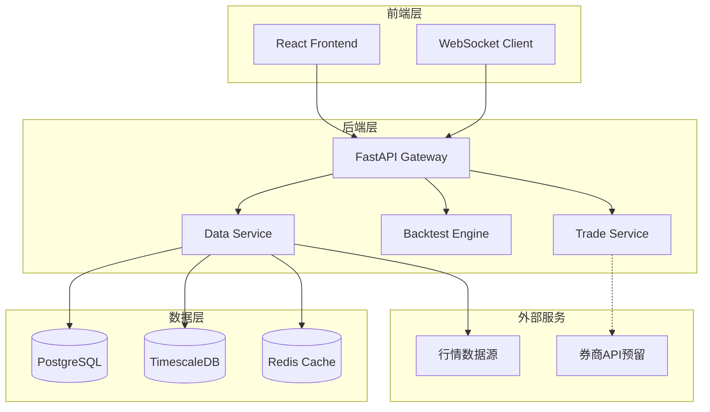
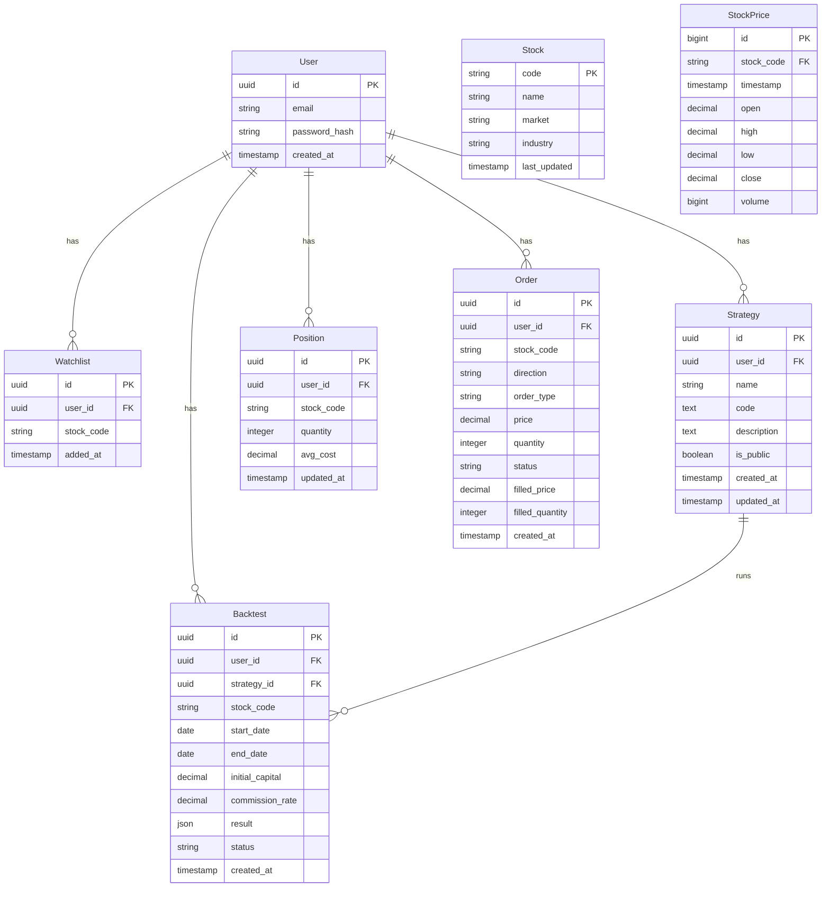
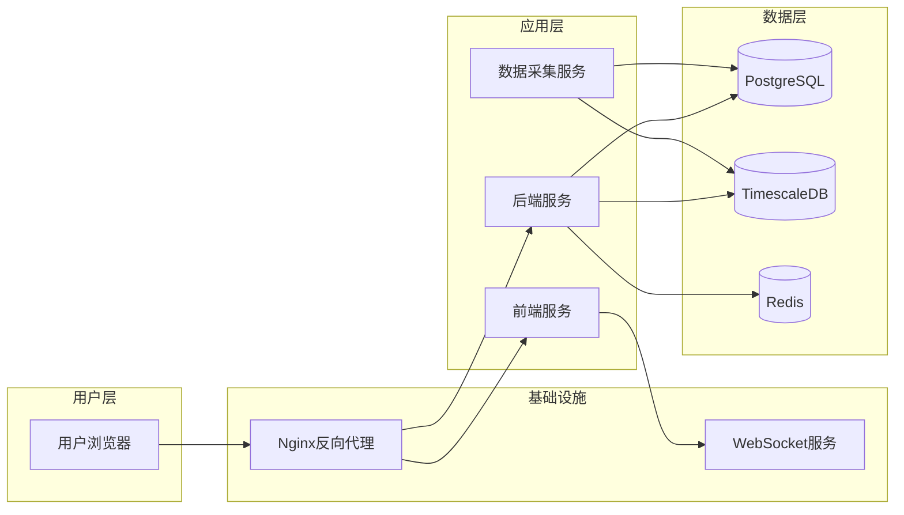

# 量化交易平台 技术架构

## 1. 架构设计



## 2. 技术选型

| 层级 | 技术 | 说明 |
|------|------|------|
| 前端 | React 18 + TypeScript | 组件化开发，类型安全 |
| 前端构建 | Vite | 快速开发启动 |
| 前端UI | TailwindCSS | 实用工具类样式 |
| 图表库 | ECharts | 金融图表（K线、分时图） |
| 代码编辑器 | Monaco Editor | VS Code同款编辑器 |
| 后端框架 | FastAPI | Python异步高性能框架 |
| 后端语言 | Python 3.11 | 数据处理、策略执行 |
| 数据库 | PostgreSQL 15 | 关系数据存储 |
| 时序数据库 | TimescaleDB | 行情时序数据 |
| 缓存 | Redis | 热点数据缓存 |
| WebSocket | FastAPI WebSocket | 实时行情推送 |
| 任务队列 | APScheduler | 定时数据采集任务 |
| 数据采集 | aiohttp + asyncio | 异步HTTP请求 |

## 3. 路由定义

### 3.1 前端路由

| 路径 | 页面 | 说明 |
|------|------|------|
| `/` | 行情首页 | 市场行情列表 |
| `/stock/:code` | 个股详情 | K线图、分时图、基本面 |
| `/watchlist` | 自选股 | 自选股管理 |
| `/strategy` | 策略列表 | 我的策略、公开策略 |
| `/strategy/new` | 策略编辑器 | 新建/编辑策略 |
| `/backtest` | 回测配置 | 配置回测参数 |
| `/backtest/result/:id` | 回测结果 | 查看回测报告 |
| `/trade` | 模拟交易 | 下单、持仓、订单 |
| `/settings` | 设置 | 实盘接口配置（预留） |

### 3.2 后端API

| 方法 | 路径 | 说明 |
|------|------|------|
| GET | `/api/v1/market/list` | 行情列表 |
| GET | `/api/v1/stock/:code` | 个股详情 |
| GET | `/api/v1/stock/:code/kline` | K线数据 |
| GET | `/api/v1/stock/:code/realtime` | 实时行情 |
| GET | `/api/v1/watchlist` | 自选股列表 |
| POST | `/api/v1/watchlist` | 添加自选 |
| DELETE | `/api/v1/watchlist/:code` | 删除自选 |
| GET | `/api/v1/strategy` | 策略列表 |
| POST | `/api/v1/strategy` | 创建策略 |
| PUT | `/api/v1/strategy/:id` | 更新策略 |
| DELETE | `/api/v1/strategy/:id` | 删除策略 |
| POST | `/api/v1/backtest` | 发起回测 |
| GET | `/api/v1/backtest/:id` | 回测结果 |
| GET | `/api/v1/trade/positions` | 持仓列表 |
| GET | `/api/v1/trade/orders` | 订单列表 |
| POST | `/api/v1/trade/order` | 下单（模拟） |
| DELETE | `/api/v1/trade/order/:id` | 撤单 |
| WS | `/ws/realtime` | 实时行情WebSocket |

## 4. API详细定义

### 4.1 行情相关

```typescript
// GET /api/v1/market/list
interface MarketListResponse {
  market: 'CN' | 'HK' | 'US';
  stocks: Array<{
    code: string;       // 股票代码
    name: string;        // 股票名称
    price: number;       // 当前价格
    change: number;      // 涨跌额
    changePercent: number; // 涨跌幅%
    volume: number;      // 成交量
    amount: number;      // 成交额
  }>;
}

// GET /api/v1/stock/:code/kline
interface KLineResponse {
  code: string;
  period: '1d' | '1w' | '1m';
  data: Array<{
    timestamp: number;
    open: number;
    high: number;
    low: number;
    close: number;
    volume: number;
  }>;
}
```

### 4.2 策略相关

```typescript
// Strategy
interface Strategy {
  id: string;
  name: string;
  code: string;          // Python代码
  description: string;
  isPublic: boolean;
  createdAt: string;
  updatedAt: string;
}
```

### 4.3 回测相关

```typescript
// POST /api/v1/backtest
interface BacktestRequest {
  strategyId: string;
  stockCode: string;
  startDate: string;
  endDate: string;
  initialCapital: number;
  commissionRate: number;
}

// 回测结果
interface BacktestResult {
  id: string;
  status: 'running' | 'completed' | 'failed';
  metrics: {
    totalReturn: number;      // 总收益率
    annualReturn: number;     // 年化收益率
    maxDrawdown: number;      // 最大回撤
    sharpeRatio: number;      // 夏普比率
    winRate: number;          // 胜率
  };
  equityCurve: Array<{ timestamp: number; value: number }>;
  trades: TradeRecord[];
}
```

### 4.4 交易相关（模拟+框架预留）

```typescript
// 订单
interface Order {
  id: string;
  code: string;
  name: string;
  direction: 'buy' | 'sell';
  type: 'market' | 'limit';
  price: number;
  quantity: number;
  status: 'pending' | 'filled' | 'cancelled';
  filledPrice?: number;
  filledQuantity?: number;
  createdAt: string;
}

// 持仓
interface Position {
  code: string;
  name: string;
  quantity: number;
  avgCost: number;        // 平均成本
  currentPrice: number;  // 当前价
  marketValue: number;   // 市值
  profitLoss: number;    // 盈亏
  profitLossPercent: number; // 盈亏%
}

// 实盘接口预留（框架）
interface BrokerAdapter {
  connect(): Promise<void>;
  disconnect(): Promise<void>;
  getBalance(): Promise<Balance>;
  getPositions(): Promise<Position[]>;
  getOrders(): Promise<Order[]>;
  placeOrder(order: OrderRequest): Promise<Order>;
  cancelOrder(orderId: string): Promise<void>;
}
```

## 5. 数据模型

### 5.1 ER图



### 5.2 数据表DDL

```sql
-- 用户表
CREATE TABLE users (
    id UUID PRIMARY KEY DEFAULT gen_random_uuid(),
    email VARCHAR(255) UNIQUE NOT NULL,
    password_hash VARCHAR(255) NOT NULL,
    created_at TIMESTAMP DEFAULT CURRENT_TIMESTAMP
);

-- 自选股表
CREATE TABLE watchlist (
    id UUID PRIMARY KEY DEFAULT gen_random_uuid(),
    user_id UUID REFERENCES users(id) ON DELETE CASCADE,
    stock_code VARCHAR(20) NOT NULL,
    added_at TIMESTAMP DEFAULT CURRENT_TIMESTAMP,
    UNIQUE(user_id, stock_code)
);

-- 策略表
CREATE TABLE strategies (
    id UUID PRIMARY KEY DEFAULT gen_random_uuid(),
    user_id UUID REFERENCES users(id) ON DELETE CASCADE,
    name VARCHAR(255) NOT NULL,
    code TEXT NOT NULL,
    description TEXT,
    is_public BOOLEAN DEFAULT FALSE,
    created_at TIMESTAMP DEFAULT CURRENT_TIMESTAMP,
    updated_at TIMESTAMP DEFAULT CURRENT_TIMESTAMP
);

-- 回测记录表
CREATE TABLE backtests (
    id UUID PRIMARY KEY DEFAULT gen_random_uuid(),
    user_id UUID REFERENCES users(id) ON DELETE CASCADE,
    strategy_id UUID REFERENCES strategies(id),
    stock_code VARCHAR(20) NOT NULL,
    start_date DATE NOT NULL,
    end_date DATE NOT NULL,
    initial_capital DECIMAL(15, 2) NOT NULL,
    commission_rate DECIMAL(5, 4) DEFAULT 0.0003,
    result JSONB,
    status VARCHAR(20) DEFAULT 'pending',
    created_at TIMESTAMP DEFAULT CURRENT_TIMESTAMP
);

-- 持仓表（模拟）
CREATE TABLE positions (
    id UUID PRIMARY KEY DEFAULT gen_random_uuid(),
    user_id UUID REFERENCES users(id) ON DELETE CASCADE,
    stock_code VARCHAR(20) NOT NULL,
    quantity INTEGER NOT NULL DEFAULT 0,
    avg_cost DECIMAL(15, 4) NOT NULL DEFAULT 0,
    updated_at TIMESTAMP DEFAULT CURRENT_TIMESTAMP,
    UNIQUE(user_id, stock_code)
);

-- 订单表（模拟+预留）
CREATE TABLE orders (
    id UUID PRIMARY KEY DEFAULT gen_random_uuid(),
    user_id UUID REFERENCES users(id) ON DELETE CASCADE,
    stock_code VARCHAR(20) NOT NULL,
    direction VARCHAR(10) NOT NULL,
    order_type VARCHAR(10) NOT NULL,
    price DECIMAL(15, 4),
    quantity INTEGER NOT NULL,
    status VARCHAR(20) DEFAULT 'pending',
    filled_price DECIMAL(15, 4),
    filled_quantity INTEGER DEFAULT 0,
    is_simulated BOOLEAN DEFAULT TRUE,
    created_at TIMESTAMP DEFAULT CURRENT_TIMESTAMP
);

-- 股票基础信息
CREATE TABLE stocks (
    code VARCHAR(20) PRIMARY KEY,
    name VARCHAR(255) NOT NULL,
    market VARCHAR(10) NOT NULL,
    industry VARCHAR(100),
    last_updated TIMESTAMP DEFAULT CURRENT_TIMESTAMP
);

-- 行情时序数据（使用TimescaleDB）
CREATE TABLE stock_prices (
    id BIGSERIAL,
    stock_code VARCHAR(20) NOT NULL,
    timestamp TIMESTAMPTZ NOT NULL,
    open DECIMAL(15, 4) NOT NULL,
    high DECIMAL(15, 4) NOT NULL,
    low DECIMAL(15, 4) NOT NULL,
    close DECIMAL(15, 4) NOT NULL,
    volume BIGINT NOT NULL,
    PRIMARY KEY (stock_code, timestamp)
);

SELECT create_hypertable('stock_prices', 'timestamp');
```

## 6. 目录结构

```
quant-platform/
├── frontend/                  # 前端项目
│   ├── src/
│   │   ├── components/        # 通用组件
│   │   ├── pages/             # 页面组件
│   │   ├── hooks/             # 自定义Hooks
│   │   ├── services/          # API服务
│   │   ├── stores/            # 状态管理
│   │   ├── types/             # TypeScript类型
│   │   └── utils/             # 工具函数
│   ├── public/
│   └── package.json
│
├── backend/                   # 后端项目
│   ├── app/
│   │   ├── api/               # API路由
│   │   ├── core/              # 核心配置
│   │   ├── models/            # 数据模型
│   │   ├── services/          # 业务逻辑
│   │   ├── tasks/             # 定时任务
│   │   └── main.py            # 入口文件
│   ├── requirements.txt
│   └── Dockerfile
│
├── scripts/                   # 脚本
│   └── data_collector.py      # 数据采集脚本
│
└── docker-compose.yml         # 容器编排
```

## 7. 实盘交易框架预留

```python
# broker/base.py - 券商适配器基类
from abc import ABC, abstractmethod
from dataclasses import dataclass
from typing import List, Optional
from enum import Enum

class OrderType(Enum):
    MARKET = "market"
    LIMIT = "limit"

class Direction(Enum):
    BUY = "buy"
    SELL = "sell"

class OrderStatus(Enum):
    PENDING = "pending"
    FILLED = "filled"
    CANCELLED = "cancelled"
    REJECTED = "rejected"

@dataclass
class OrderRequest:
    stock_code: str
    direction: Direction
    order_type: OrderType
    price: Optional[float]
    quantity: int

@dataclass
class Order:
    id: str
    stock_code: str
    direction: Direction
    order_type: OrderType
    price: float
    quantity: int
    status: OrderStatus
    filled_price: Optional[float] = None
    filled_quantity: int = 0
    created_at: Optional[str] = None

@dataclass
class Position:
    stock_code: str
    stock_name: str
    quantity: int
    avg_cost: float
    current_price: float
    market_value: float
    profit_loss: float

@dataclass
class Balance:
    cash: float
    total_assets: float
    frozen: float

class BrokerAdapter(ABC):
    """券商适配器基类 - 实盘交易框架预留"""

    @abstractmethod
    async def connect(self) -> None:
        """连接券商账户"""
        pass

    @abstractmethod
    async def disconnect(self) -> None:
        """断开连接"""
        pass

    @abstractmethod
    async def get_balance(self) -> Balance:
        """获取账户余额"""
        pass

    @abstractmethod
    async def get_positions(self) -> List[Position]:
        """获取持仓"""
        pass

    @abstractmethod
    async def get_orders(self) -> List[Order]:
        """获取订单列表"""
        pass

    @abstractmethod
    async def place_order(self, order: OrderRequest) -> Order:
        """下单"""
        pass

    @abstractmethod
    async def cancel_order(self, order_id: str) -> bool:
        """撤单"""
        pass
```

---

## 8. 部署架构


